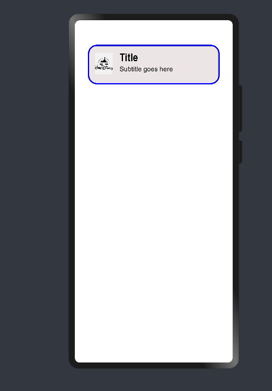

# Material_Cards

Material Card Design in OpenHarmony.

## Usage Instructions

1. Import files and code dependencies

```ets
import {button,CardModel,CardType,MediaIconPosition,MaterialCard} from '@ohos/material-card'
```
2. Initialize CardModel model data

```
private model : CardModel =new CardModel('Title' , 'Subtitle')
```
3. Code for creating a basic Outlined Card. Set the Card Parameters based on the requirement.

```
 private subHead : CardModel =new CardModel('Title' , 'Subtitle')
 
 this.subHead.setCardHeight(90)
 this.subHead.setCardWidth(300)
 this.subHead.setCardType(CardType.Outlined)
 this.subHead.setCardBorderWidth(3)
 this.subHead.setLeadingIcon($r('app.media.disneylogo'))
 this.subHead.setCardBackGroundColor('#ffece5e5')
 this.subHead.setLeadingIconHeight(64)
 this.subHead.setLeadingIconWidth(64)
   
MaterialCard({
          model : this.subHead
            })
```


4. Code for Complete Filled Card. Set/Change the card default Parameters based on the requirement. 
```
private model: CardModel =new CardModel('Title' , 'subTitle')

    this.model.setCardBackGroundColor('#ffffdef0')
    this.model.setCardType(CardType.Normal)
    this.model.setLeadingIcon($r('app.media.disneylogo'))
    this.model.setMediaIcon($r('app.media.brave'))
    this.model.setCardHeight(520)
    this.model.setShowDivider(true)
    this.model.setButtonHeader('Show Timings')
    this.model.setSupportingText("Determined to make her own path in life, Princess Merida defies " +
                                  "a custom that brings chaos to her kingdom. Granted one wish, Merida ")
    this.model.setShadowColor('#d0fa7fff')
    this.model.setShadowRadius(40)
    this.model.setBorderRadius(3)
    this.model.setMediaIconPosition(MediaIconPosition.Top) 
```
Note: 1)To change the position of the  Media Icon Image, change MediaIconPosition. Default is set as 'Middle'.
      2)To change the Type of the Card, change cardType. Default is set as 'Normal' i.e., Filled Card.
