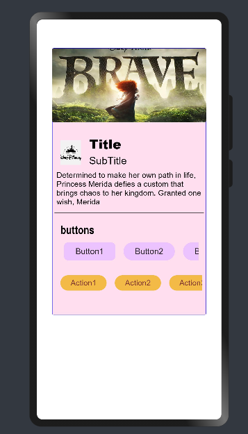

# Material_Cards

Material Card Design in OpenHarmony.

## Usage Instructions

1. Import files and code dependencies

```ets
import {button,CardModel,CardType,MediaIconPosition,MaterialCard} from '@ohos/material-card'
```
2. Initialize CardModel model data

```
private model : CardModel =new CardModel('Title' , 'Subtitle')
```
3. Code for creating a basic Outlined Card. Set the Card Parameters based on the requirement.
```
 private subHead : CardModel =new CardModel('Title' , 'Subtitle')
 
 this.subHead.setCardHeight(90)
 this.subHead.setCardWidth(300)
 this.subHead.setCardType(CardType.Outlined)
 this.subHead.setCardBorderWidth(3)
 this.subHead.setLeadingIcon($r('app.media.disneylogo'))
 this.subHead.setCardBackGroundColor('#ffece5e5')
 this.subHead.setLeadingIconHeight(64)
 this.subHead.setLeadingIconWidth(64)
   
MaterialCard({
          model : this.subHead
            })
```
Note : To change the Type of the Card, change cardType. Default is set as 'Normal' i.e., Filled Card.


4. Code for Complete Filled Card. Set/Change the card default Parameters based on the requirement. 
```c
private model: CardModel =new CardModel('Title' , 'subTitle')
aboutToAppear(){
    this.model.setCardBackGroundColor('#ffffdef0')
    this.model.setCardType(CardType.Normal)
    this.model.setLeadingIcon($r('app.media.disneylogo'))
    this.model.setMediaIcon($r('app.media.brave'))
    this.model.setCardHeight(520)
    this.model.setShowDivider(true)
    this.model.setButtonHeader('Show Timings')
    this.model.setSupportingText("Determined to make her own path in life, Princess Merida defies " +
                                    "a custom that brings chaos to her kingdom. Granted one wish, Merida ")
    this.model.setShadowColor('#d0fa7fff')
    this.model.setShadowRadius(40)
    this.model.setBorderRadius(3)
    this.model.setMediaIconPosition(MediaIconPosition.Top)
    this.model.setButtons([new button.Model('Button1',false, '#ff242222', '#ffecc2ff', 15, ButtonType.Normal, 35, 100),
                            new button.Model('Button2',false, '#ff242222', '#ffecc2ff', 15, ButtonType.Capsule, 35, 100),
                            new button.Model('Button3',false, '#ff242222', '#ffecc2ff', 15, ButtonType.Capsule, 35, 100),
                            new button.Model('Button4',false, '#ff242222', '#ffecc2ff', 15, ButtonType.Capsule, 35, 100),
                            new button.Model('Button5',false, '#ff242222', '#ffecc2ff', 15, ButtonType.Capsule, 35, 100)])
    this.model.setActions([new button.Model('Action1',false, '#ff7e3636', '#fff3bb45', 15, ButtonType.Capsule, 30, 90),
                            new button.Model('Action2',false, '#ff7e3636', '#fff3bb45', 15, ButtonType.Capsule, 30, 90),
                            new button.Model('Action3',false, '#ff7e3636', '#fff3bb45', 15, ButtonType.Capsule, 30, 90),
                            new button.Model('Action4',false, '#ff7e3636', '#fff3bb45', 15, ButtonType.Capsule, 30, 90),
                            new button.Model('Action5',false, '#ff7e3636', '#fff3bb45', 15, ButtonType.Capsule, 30, 90),])
}
build() {
    Column() {
        MaterialCard({
            model : this.model
        })
    }.width('100%')
}
```


Button can be added to the Card in the form an array . Pass the buttons in the form of an array. 

Passing only the ButtonText is compulsary. 

Passing Parameter layout is given below
```c
    button1 : button.Model = new this.button.Model(buttonText,isText,fontColor,buttonColor,fontSize,ButtonType,buttonHeight,buttonWidth)
```
Note: To change the position of the  Media Icon Image, change MediaIconPosition. Default is set as 'Middle'. 
```c
this.model.setMediaIconPosition(MediaIconPosition.Top) 
```